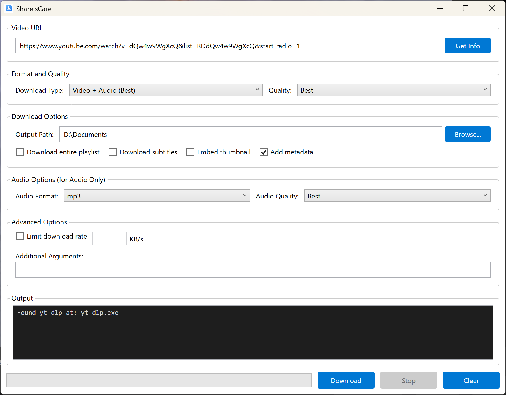

# yt-dlp GUI

A modern, feature-rich Windows desktop application built with WPF and C# that provides a graphical user interface for [yt-dlp](https://github.com/yt-dlp/yt-dlp), the popular command-line video downloader.


## Features



### 📥 Download Options
- **Video + Audio** - Download best quality video with audio merged
- **Audio Only** - Extract audio in various formats (MP3, M4A, Opus, FLAC, WAV, Vorbis)
- **Video Only** - Download video without audio track
- **Custom Format** - Advanced format string support for power users

### 🎯 Quality Selection
- Preset quality options: Best, 4K (2160p), 2K (1440p), 1080p, 720p, 480p, 360p
- Audio quality options: Best, 320K, 256K, 192K, 128K
- Automatic format selection based on quality preferences

### ⚙️ Advanced Features
- ✅ Playlist download support
- ✅ Subtitle download (auto-generated and manual)
- ✅ Thumbnail embedding
- ✅ Metadata embedding
- ✅ Download rate limiting
- ✅ Real-time progress tracking
- ✅ Custom output directory selection
- ✅ Additional command-line arguments support

### 🎨 User Interface
- Clean, modern WPF design
- Real-time console output
- Progress bar with percentage display
- Start/Stop/Clear controls
- Video information preview

## Prerequisites

- **Windows 10/11** (or Windows with .NET 6.0 support)
- **.NET 6.0 Runtime** or later ([Download here](https://dotnet.microsoft.com/download/dotnet/6.0))
- **yt-dlp.exe** (included in the project or [download manually](https://github.com/yt-dlp/yt-dlp/releases))

## Installation

### Option 1: Download the pre-build zip
1. Choose the newest version from the [Release Page](https://github.com/LoveIiei/ShareIsCare/releases/)
2. Follow the guidelines on that page

### Option 2: Build from Source

1. **Clone the repository**
   ```bash
   git clone https://github.com/yourusername/ytdlp-gui.git
   cd ytdlp-gui
   ```

2. **Add yt-dlp.exe**
   - Download `yt-dlp.exe` from [yt-dlp releases](https://github.com/yt-dlp/yt-dlp/releases)
   - Place it in the project root directory
   - Ensure it's set to copy to output directory (should be configured in .csproj)

3. **Build the project**
   ```bash
   dotnet build
   ```

4. **Run the application**
   ```bash
   dotnet run
   ```

### Option 3: Using Visual Studio

1. Open `YtDlpGui.sln` in Visual Studio 2022 or later
2. Ensure `yt-dlp.exe` is in the project with "Copy to Output Directory" set to "Copy if newer"
3. Press `F5` to build and run

## Usage

### Basic Download

1. **Enter URL**: Paste a video or playlist URL in the URL field
2. **Select Download Type**: Choose between Video+Audio, Audio Only, Video Only, or Custom
3. **Choose Quality**: Select your preferred quality setting
4. **Set Output Path**: Browse to select where files should be saved
5. **Click Download**: Start the download process

### Advanced Options

#### Audio Downloads
- Select "Audio Only" as download type
- Choose audio format (MP3, M4A, etc.)
- Select audio quality

#### Playlist Downloads
- Check "Download entire playlist" to download all videos in a playlist
- Uncheck to download only the first video

#### Subtitles & Metadata
- **Download subtitles**: Downloads embedded and auto-generated subtitles
- **Embed thumbnail**: Adds video thumbnail to the downloaded file
- **Add metadata**: Embeds title, artist, and other metadata

#### Rate Limiting
- Check "Limit download rate"
- Enter speed in KB/s to avoid saturating your connection

#### Custom Arguments
- Add any yt-dlp command-line arguments in the "Additional Arguments" field
- Example: `--proxy http://proxy:port` or `--cookies-from-browser chrome`

### Get Video Info

Click the **"Get Info"** button to retrieve video information without downloading, useful for:
- Checking available formats
- Viewing video metadata
- Verifying URL validity

## Project Structure

```
YtDlpGui/
├── App.xaml                 # Application resources and styles
├── App.xaml.cs              # Application entry point
├── MainWindow.xaml          # Main UI layout
├── MainWindow.xaml.cs       # UI logic and yt-dlp integration
├── YtDlpGui.csproj          # Project configuration
├── yt-dlp.exe               # yt-dlp executable (included as resource)
└── README.md                # This file
```

## Configuration

### yt-dlp Path
The application automatically looks for `yt-dlp.exe` in:
1. Application directory (next to the .exe)
2. User's home directory
3. If not found, prompts user to locate it manually

### Default Settings
- **Output Path**: User's Downloads folder
- **Download Type**: Video + Audio (Best)
- **Quality**: Best available
- **Metadata**: Enabled by default

## Troubleshooting

### yt-dlp.exe Not Found
- Ensure `yt-dlp.exe` is in the same directory as the application
- Or specify the path when prompted on first launch
- Download the latest version from [yt-dlp releases](https://github.com/yt-dlp/yt-dlp/releases)

### Download Fails
- Check your internet connection
- Verify the URL is valid and accessible
- Check the output log for specific error messages
- Try adding `--verbose` in Additional Arguments for detailed logs

### FFmpeg Required Error
Some features (like merging video/audio or format conversion) require FFmpeg:
- Download FFmpeg from [ffmpeg.org](https://ffmpeg.org/download.html)
- Place `ffmpeg.exe` in the same directory as the application
- Or add it to your system PATH

### Permission Errors
- Ensure you have write permissions for the output directory
- Try running as administrator if issues persist
- Check if antivirus is blocking the download

## Building for Release

```bash
# Build release version
dotnet publish -c Release -r win-x64 --self-contained false

# Build self-contained (includes .NET runtime)
dotnet publish -c Release -r win-x64 --self-contained true
```

Output will be in `bin/Release/net6.0-windows/win-x64/publish/`

## Dependencies

- **.NET 6.0** - Application framework
- **yt-dlp** - Video downloading engine
- **FFmpeg** (optional) - Media processing (usually bundled with yt-dlp)

## Credits

- **yt-dlp**: [https://github.com/yt-dlp/yt-dlp](https://github.com/yt-dlp/yt-dlp)
- Built with WPF and C#

## License

This project is licensed under the MIT License - see the LICENSE file for details.

## Contributing

Contributions are welcome! Please feel free to submit a Pull Request.

1. Fork the project
2. Create your feature branch (`git checkout -b feature/AmazingFeature`)
3. Commit your changes (`git commit -m 'Add some AmazingFeature'`)
4. Push to the branch (`git push origin feature/AmazingFeature`)
5. Open a Pull Request

## Roadmap

- [ ] Batch download support (multiple URLs)
- [ ] Download history and queue management
- [ ] Format preview with available quality options
- [ ] Custom output filename templates
- [ ] Dark/Light theme toggle
- [ ] Localization support
- [ ] Update checker for yt-dlp
- [ ] Portable mode (no installation required)

## Support

If you encounter any issues or have questions:
- Open an issue on GitHub
- Check [yt-dlp documentation](https://github.com/yt-dlp/yt-dlp#usage-and-options)
- Review existing issues for solutions

## Disclaimer

This application is a GUI wrapper for yt-dlp. Please ensure you have the right to download any content and comply with the terms of service of the websites you're downloading from.

---

**Star ⭐ this repository if you find it helpful!**
